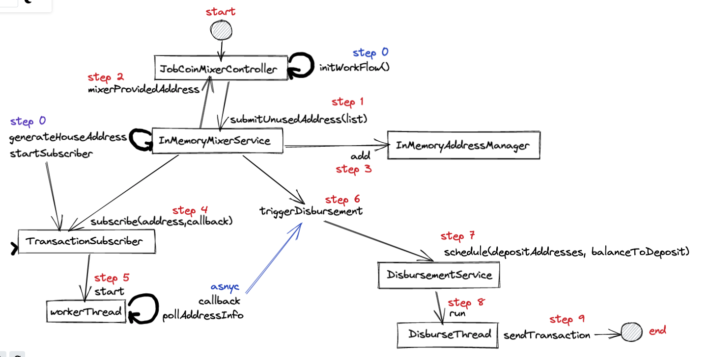
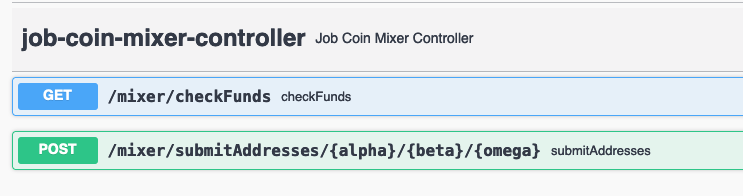

#Read Me

Here is the small diagram of all the chain of events.



## Run instructions

1. `src/main/resources` has `application.properties` for configuration variables
2. Please run `src/main/java/com/gemini/mixer/GeminiJobCoinMixerApplication.java`

## How to use swagger API? 

### URL http://localhost:8080/swagger-ui/index.html#/



### Use POST submitAddresses to create user submitted addresses

User will use `/mixer/submitAddresses/{alpha}/{beta}/{omega}` api endpoint
to submit some addresses and in response api provides
address where mixer will setup polling,

API Response:

`{"depositAddress":"1e8715f3-fc2e-4581-9d2f-0214006e78bc"}`

### Run GET checkFunds to information on submitted addresses

Please use `/mixer/checkFunds` api endpoint to find out status of funds in
provided addresses.

API Response:

```json
[
  {
    // mixer address
    "address": "1e8715f3-fc2e-4581-9d2f-0214006e78bc",
    "balance": "0",
    // user's alpha, beta, omega addresses
    "depositAddresses": [
      {
        "address": "aa",
        "balance": "37.56"
      },
      {
        "address": "ab",
        "balance": "29.78"
      },
      {
        "address": "ac",
        "balance": "30.66"
      }
    ]
  }
]
```

#### Console activity: On funds received

```
---------------------------------------------------------
{subscriber watching and sleeping}
---------------------------------------------------------
Sleeping for 5 sec.....
Sleeping for 5 sec.....
---------------------------------------------------------
Scheduling disbursement...
{following line is funds transfer to house address}
---------------------------------------------------------
Sending coins {250} from address {d519fe42-59bf-4d1b-a330-c59fed45d1c6} to address {64e873cd-4e64-428c-9ca6-ba51d50819c3}
---------------------------------------------------------
{following lines are funds transfer from house address to users prodvides addresses}
---------------------------------------------------------
Send Transaction: from: d519fe42-59bf-4d1b-a330-c59fed45d1c6, to: 64e873cd-4e64-428c-9ca6-ba51d50819c3, balance: 250
Sleeping for 5 sec.....
Send Transaction: from: 64e873cd-4e64-428c-9ca6-ba51d50819c3, to: b5ca3bcb-c305-4604-8d92-8b3c5a735fd2, balance: 1.89
Send Transaction: from: 64e873cd-4e64-428c-9ca6-ba51d50819c3, to: 3d2ec7db-c1de-4263-ad45-5ef19a41432f, balance: 3.57
Sleeping for 5 sec.....
Send Transaction: from: 64e873cd-4e64-428c-9ca6-ba51d50819c3, to: b5ca3bcb-c305-4604-8d92-8b3c5a735fd2, balance: 7.38
Send Transaction: from: 64e873cd-4e64-428c-9ca6-ba51d50819c3, to: 3d2ec7db-c1de-4263-ad45-5ef19a41432f, balance: 15.22
Sleeping for 5 sec.....
Send Transaction: from: 64e873cd-4e64-428c-9ca6-ba51d50819c3, to: b5ca3bcb-c305-4604-8d92-8b3c5a735fd2, balance: 31.05
Send Transaction: from: 64e873cd-4e64-428c-9ca6-ba51d50819c3, to: 3d2ec7db-c1de-4263-ad45-5ef19a41432f, balance: 63.35
Sleeping for 5 sec.....
Send Transaction: from: 64e873cd-4e64-428c-9ca6-ba51d50819c3, to: b5ca3bcb-c305-4604-8d92-8b3c5a735fd2, balance: 71.57
Send Transaction: from: 64e873cd-4e64-428c-9ca6-ba51d50819c3, to: 3d2ec7db-c1de-4263-ad45-5ef19a41432f, balance: 54.97
Sleeping for 5 sec.....
Disbursement complete for addresses [b5ca3bcb-c305-4604-8d92-8b3c5a735fd2, 3d2ec7db-c1de-4263-ad45-5ef19a41432f]
```

## My Thoughts

Following list of core components implemented as part of this exercise.

1. InMemoryMixerService `main mixer logic`
2. InMemoryAddressManager `mixer keeps mapping of addresses`
3. TransactionSubscriber `watches and polls on subscribed addresses`
4. DisbursementService `disburse funds once funds mixed into house`

Two additional helper components,

1. JobCoinMixerController `starts processes`
2. JobCoinChainService `rest client for gemini api`

#### Note:
All the above components contract in package `com.gemini.mixer.service.contract`
and I have implemented in-memory version of this service contract.

1. IMixer
2. ISubscriber
3. IAddressManager
4. IDisbursement
5. OnTransactionReceived `callback api when polling notices fund transfer`

## Use case implementation

### 1. You provide a list of new unused address that you own to mixer

This use case is implemented using the `IMixer` contract. Also, as soon as
app start `JobCoinMixerController` send two unused address and submits
to mixer using this contract method.

Also, subscribers start watching these addresses.

### 2. Mixer provides with deposit address
`mixer.submitUnusedAddress(addresses)` method also return deposit address

### 3. You transfer coins into address which to mixer provided

User action

### 4. Mixer detects coin transfer

Following code snippet in `InMemoryMixerService` show's example of how I have
implemented the first 1 to 4 use cases.

```java
// automated call from 'JobCoinMixerController'
public String submitUnusedAddress(List<String> addresses) {
 assertAllAddressesAreUnused(addresses);
 // mixer provides new unused address
 String depositAddress = generateRandomUnusedAddress();
 // keep record where to distribute funds
 addressManager.add(depositAddress, addresses);
 // subscribe to polling
 subscriber.subscribe(depositAddress, this::triggerDisbursement);
 return depositAddress;
}
```

### 5. Mixer transfer's coins into big house address

Above code passes `callback` function in the `subscriber.subscribe()` method which
gets invoked during polling. And following code block transfer funds into
big house wallet

### 6. Fund disbursement into accounts

At this point we will schedule funds disbursement.

Implementation of point 5 and 6,

```java
// When polling identifies activity this block is called
private void triggerDisbursement(String address, String balance) {
 logger.info("Scheduling disbursement...");
 logger.info(String.format("Sending coins {%s} from address {%s} to address {%s}", balance, address, houseAddress));
 // sending coins to house address
 jobCoinChainService.sendTransaction(address, houseAddress, balance);
 // disburse funds
 disbursement.schedule(addressManager.get(address), Double.parseDouble(balance));
}
```


## Unit Tests

Main core components have individual unit test files where functionality
for that module has been tested. All outgoing calls to other components
has been mocked using `mockito` lib.

1. InMemoryMixerServiceTest
2. InMemoryAddressManagerTest
3. TransactionSubscriberTest
4. DisbursementServiceTest
